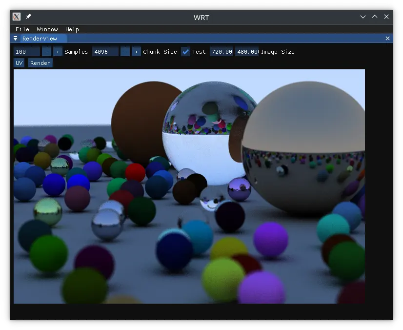

# Weekend Raytracer

This is my obligatory raytracing project following the [Ray Tracing In One Weekend](https://github.com/RayTracing/raytracing.github.io) series.  Currently I've only completed the first one, but I have had some fun playing around with some extra features of my own in the process.

In addition to following the basic tutorial, I implemented a simple gui using [Dear ImGui](https://github.com/ocornut/imgui) and added multithreading to render images faster.

A lot of this is still experimental and a fun toy.  You can:

- Set the number of samples to render per pixel
- Adjust chunk size of per thread rendered chunks (current iteration does not seem to affect performance much)
- Check the 'Test' checkbox to run my own multithreading implementation or uncheck it to use `std::transform` (does not yet run in parallel on Linux due to some issues adding TBB, to be fixed)
- Set the overall image size to be rendered
- Render a UV image
- Render an image of a bunch of random spheres

## Building

If you want to try it out yourself, the following should work.

### Linux

Run `./refresh_gmake2.sh` which will generate a makefile.  You can then build with `make WeekendRayTracer` which will download and install the needed dependencies with vcpkg and create the output in a new bin directory.

### Windows

Run `./refresh_vs.sh` to set up a Visual Studio project.  You should then be good to go building it in Visual Studio.  Dependencies are managed with vcpkg, which should run and install the needed dependencies when a build is run.
